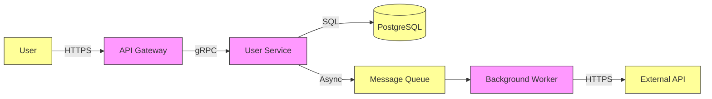

# Threat Model Template

Use this template for lightweight threat modeling (STRIDE) on new features or architecture changes.
Copy to `docs/threat-models/feature-name.md`.

---

# Threat Model: [Feature/Component Name]

**Date**: YYYY-MM-DD
**Author**: [Name]
**Reviewers**: [Names]
**Status**: Draft | Reviewed | Accepted
**Related**: [PR #, ADR #, Issue #]

---

## System Overview

Brief description of the feature/component being modeled.

- **Purpose**: What does this do?
- **Actors**: Users, services, external systems interacting
- **Data Classification**: Public / Internal / Confidential / Restricted
- **Trust Boundaries**: Where trust zones change (e.g., internet → API → database)

---

## Data Flow Diagram (Mermaid)

*Update this diagram to reflect your component's data flows.*

---

## STRIDE Analysis

For each threat category, identify specific threats, likelihood, impact, and mitigations.

### Spoofing (Impersonation)
*Can an attacker pretend to be a legitimate user/service?*

| Threat | Likelihood | Impact | Mitigation | Residual Risk |
|--------|------------|--------|------------|---------------|
| e.g., Stolen JWT used to access API | Medium | High | Short expiry, rotation, revocation list | Low |
| | | | | |

### Tampering (Data Modification)
*Can data be modified in transit or storage?*

| Threat | Likelihood | Impact | Mitigation | Residual Risk |
|--------|------------|--------|------------|---------------|
| e.g., MITM modifies API response | Low | High | TLS 1.3, HSTS, certificate pinning | Very Low |
| | | | | |

### Repudiation (Denial of Actions)
*Can actions be denied without proof?*

| Threat | Likelihood | Impact | Mitigation | Residual Risk |
|--------|------------|--------|------------|---------------|
| e.g., User denies making payment | Medium | Medium | Audit logs with tamper-evident storage | Low |
| | | | | |

### Information Disclosure (Data Leakage)
*Can sensitive data be exposed?*

| Threat | Likelihood | Impact | Mitigation | Residual Risk |
|--------|------------|--------|------------|---------------|
| e.g., PII in error logs | Medium | High | Structured logging with redaction, log filtering | Low |
| | | | | |

### Denial of Service (Availability)
*Can the service be made unavailable?*

| Threat | Likelihood | Impact | Mitigation | Residual Risk |
|--------|------------|--------|------------|---------------|
| e.g., Unbounded query exhausts DB | Medium | High | Query timeouts, pagination limits, rate limiting | Low |
| | | | | |

### Elevation of Privilege (Authorization Bypass)
*Can attacker gain higher permissions?*

| Threat | Likelihood | Impact | Mitigation | Residual Risk |
|--------|------------|--------|------------|---------------|
| e.g., IDOR allows accessing other users' data | Medium | High | Authorization checks on every request, integration tests | Low |
| | | | | |

---

## Summary

| Category | Threats Identified | Mitigated | Residual (Accepted) |
|----------|-------------------|-----------|---------------------|
| Spoofing | X | X | 0 |
| Tampering | X | X | 0 |
| Repudiation | X | X | 0 |
| Info Disclosure | X | X | 0 |
| DoS | X | X | 0 |
| Elevation | X | X | 0 |

**Overall Risk Rating**: Low | Medium | High

---

## Action Items

| Item | Owner | Due Date | Status |
|------|-------|----------|--------|
| Implement rate limiting on login endpoint | [Name] | YYYY-MM-DD | TODO |
| Add audit logging for admin actions | [Name] | YYYY-MM-DD | TODO |
| | | | |

---

## Review Notes

[Space for reviewer comments, questions, and approvals]